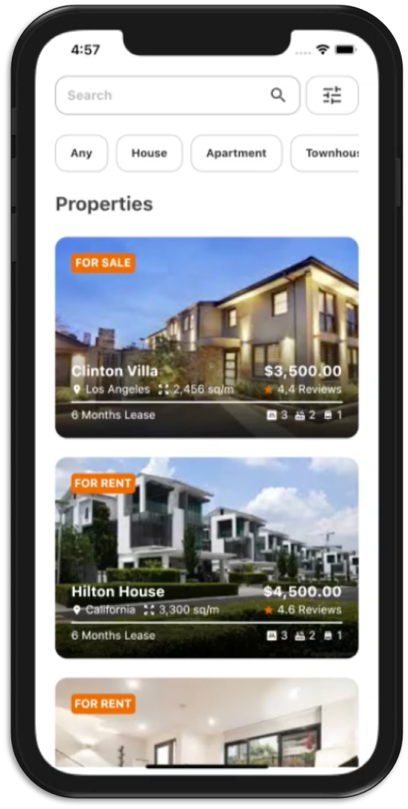
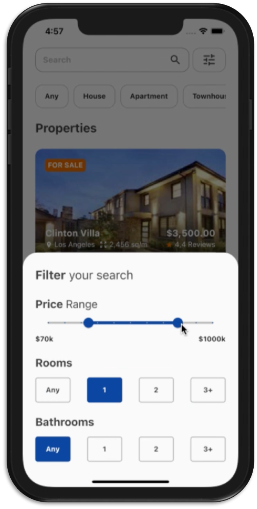
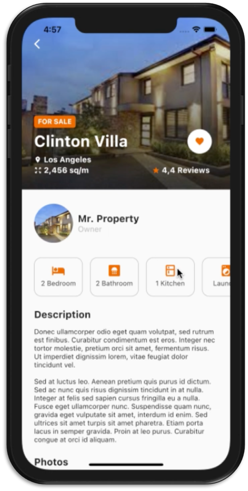

Flutter - UI Real State

## Image




## Installation
To clone and run this project:
```sh
cd newProject
$ git clone https://github.com/pbmena/real_state_app.git
flutter run android|ios
```
## Design Inspiration
- https://dribbble.com/shots/9399345-Filter-Screen-Real-Estate-App
- https://dribbble.com/shots/13902653-Real-Estate-Mobile-App